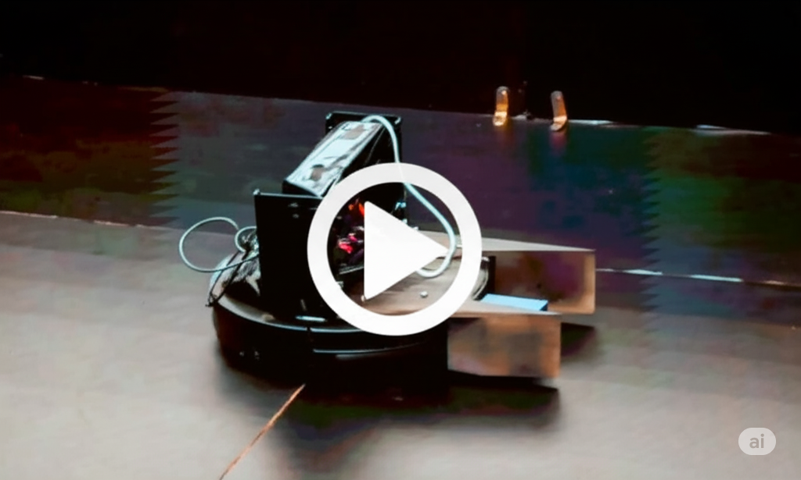

# IESL RoboGames 2024 🤖

### Overview

IESLRoboGames is a robotics competition focused on simulating real-world robotics tasks using the Webots simulator. The competition tests navigation, obstacle avoidance, color detection, and task-based behaviors under simulated constraints. The final round of this competition includes controlling the kobuki mobile robot.

This repository contains the source code, world files, and controller scripts developed for IESLRoboGames2024.

### Project Features

#### Preliminary Round
 - Webots world customized for RoboGames challenges

#### Final Round
 - Python controllers implementing logic for:
   - Obstacle avoidance
   - Color detection (using simulated camera/sensor)
   - Controlling real world kobuki robot using Raspberry pi 5
   - Task-specific maneuvers (e.g., box pickup, docking)

 - Sensor integration: Xbox 360 Kinect Sensor (Camera & Depth Sensor)

---

## First Runner-up – IESL RoboGames 2024 🏆

---

---

## 🎥 A video demonstration of our work 🤖

---

